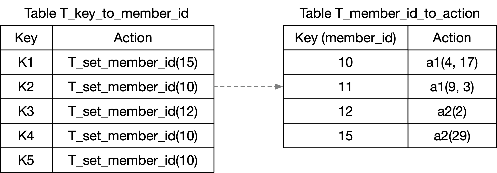

# action_profile tables

Having a table `T` with `implementation = action_profile(N)` in a
P4_16 program with the v1model architecture, like this:

```
    // Program fragment #1

    table T {
        key = { <table T keyElementList> }
        actions = { <table T actionList> }
        <other tableProperties of table T here>
        implementation = action_profile(N);
    }

    // to apply the table:
    T.apply();
```

is functionally equivalent to the code below with two tables:


```
    // Program fragment #2

    // X is the smallest integer such that 2^X >= N, so that a bit<X>
    // value is just large enough to represent an index into a table
    // with N entries.
    bit<X> T_member_id;

    action T_set_member_id (bit<X> member_id) {
        T_member_id = member_id;
    }
    table T_key_to_member_id {
        key = { <table T keyElementList> }
        actions = { T_set_member_id; }
        <other tableProperties of table T here>
    }
    table T_member_id_to_action {
        key = { T_member_id : exact; }
        actions = { <table T actionList> }
        size = N;
    }

    // to apply the table:
    T_key_to_member_id.apply();
    T_member_id_to_action.apply();
```


# Example table configuration and packet processing

Below is a figure showing an example configuration with a few entries
in the two tables of Program fragment #2.



For example, if a packet looks up table `T_key_to_member_id` and
matches the entry with key K3, the action will perform the assignment
`T_member_id = 12`.  When table `T_member_id_to_action` is looked up,
it will match the entry with key 12, and execute the action `a2(2)`,
where `a2` in this example is one of the actions that the P4 developer
specified in table `T`'s action list.


# Why might an action profile be useful?

Whether you use an action selector extern, or in general two tables
with a "linking field" like `T_member_id` is for the two-table
implementation above, what are the properties of this that are useful?


## Reducing storage space in the data plane

Storage space in high speed data planes is usually expensive, relative
to general purpose DRAM in a laptop or server machine (see [How much
does on-chip memory cost vs. commodity
DRAM?](docs/cost-of-high-speed-storage.md)).

If you have a table `T` with `M` entries, and the action parameters
require `W` bits of storage, implementing that as a single P4 table
will typically take at least `M*W` bits of storage in the data plane.
If in your use case, the action parameters of those `M` entries can
all be different from each other, then it might not be possible to
reduce that.

However, if for a particular table `T` you know that you only need at
most `N` different sets of `action plus action parameter values` at a
time, then the storage for an action selector is `M*X + N*W` bits of
storage, where `X = lg(N)` is the base 2 logarithm of `N`, the number
of bits required to represent the value `T_member_id` in the P4 code
above.

As just one example of the storage reduction possible, consider
`M=100,000` entries with action parameters that include a source MAC
and destination MAC address, so `W=96` bits.

+ With single table, storage is `M*W = 9,600,000` bits.

+ With restriction of at most `N = 1,000` different action parameter
  values and using an action profile (or the two table implementation
  described above), the storage is `M*X + N*W = 100,000 * 10 + 1,000 *
  96 = 1,096,000` bits.


## Reducing the time to make updates in packet processing behavior

Regardless of the storage requirements, having a level of indirection
in tables can enable some kinds of updates in packet processing
behavior to be drastically more efficient, than if those levels of
indirection are not present.

For example, suppose that you create an action profile member that
sends all packets to port 7.  In your table, you add 1,000 entries
with different keys that all use that member.  If at some later point
in time you wish all of those 1,000 entries to instead perform a
different action, e.g. one that sends all packets to port 10, then
updating that one member action suffices to achieve that change in
behavior.  It requires updating only one table entry in hardware.

If you instead had completely independent actions in all entries of
your table, you would need to update 1,000 of its entries to achieve
the same effect.


# Restrictions enforced on control plane software for action profiles

The next section contains details about the Thrift API for the open
source simple_switch process, and the commands exposed to exercise
that API via the simple_switch_CLI command.  The details of other
control plane APIs, e.g. the P4Runtime API or Barefoot/Intel Runtime
API are different, but not described here.

I believe one property that they all have in common for action
profiles is:

+ member_id existence checking, or "no dangling member_id references":
  + It is an error to attempt to add an entry to table
    `T_key_to_member_id` with a `member_id` value that is not
    currently a key in table `T_member_id_to_action`.
    + Example: In the configuration of the previous section, it is an
      error to attempt to add an entry to `T_key_to_member_id` with
      action `T_set_member_id(18)`, because there is not currently any
      entry in `T_member_id_to_action` with key 18.
  + It is an error to attempt to delete an entry from table
    `T_member_id_to_action` with key `member_id` equal to X if there
    is currently any action `T_set_member_id(X)` in any entry of
    `T_key_to_member_id`.
    + Example: In the configuration of the previous section, it is an
      error to attempt to delete the entry with key 12 from table
      `T_member_id_to_action`, because there is still an entry in
      table `T_key_to_member_id` with action `T_set_member_id(12)`
      (the one with key K3).

In other words, the data plane driver software prevents the control
plane software from writing a state to the data plane where a
`member_id` value is assigned by action `T_set_member_id` that results
in a miss when looking it up in table `T_member_id_to_action`.

If one writes code like in Program fragment #2 and uses the control
plane APIs for adding, deleting, and modifying entries in tables
`T_key_to_member_id` and `T_member_id_to_action`, these restrictions
are _not_ enforced by the data plane driver software.  The control
plane software _can_ write a configuration to the data plane where a
miss can occur when looking up table `T_member_id_to_action`.


# Details specific to simple_switch Thrift API and simple_switch_CLI commands

In simple_switch_CLI, the following special commands for dealing with
tables that have an action profile implementation are implemented as
described.

    Original simple_switch_CLI command:
    act_prof_create_member <action_profile_name> <action_name> [action parameters]
    Implemented as:
    table_add T_member_id_to_action <action_name> <idx> => [action parameters]
         where <idx> is an arbitrary integer in the range [0, N-1]
         that is not currently a key that has been added to table
         T_member_id_to_action.

    Original simple_switch_CLI command:
    act_prof_delete_member <action_profile_name> <member handle>

    Implemented as:
    table_delete T_member_id_to_action <entry handle>
         where <entry handle> is the value assigned by simple_switch
         to the table T_member_id_to_action entry when it was
         added.

         It is an error to attempt to do this when there are one or
         more entries in table T_key_to_member_id that set this
         entry's member_id.

    Original simple_switch_CLI command:
    act_prof_modify_member <action profile name> <action_name> <member_handle> [action parameters]

    Implemented as:
    table_modify T_member_id_to_action <action name> <entry handle> [action parameters]
         where <entry handle> is the value assigned by simple_switch
         to the table T_member_id_to_action entry when it was
         added.

simple_switch and simple_switch_CLI already contain a consistency
check that gives an error, and does not remove an action profile
member, if there is still at least one table entry that uses it.  If
implemented as 2 separate tables, it would be good to have a similar
consistency check in the control software to prevent removing an entry
from T_member_id_to_action if its `<idx>` value is still one of the
possible values set by an entry of T_key_to_member_id.  One way to
implement this is to maintain a reference count for each member.

Similarly one should disallow adding an entry to T_key_to_member_id
that uses a particular value of `<idx>`, unless T_member_id_to_action
currently has an entry for key `<idx>`.  simple_switch gives error
INVALID_MBR_HANDLE if you attempt to do this.  If this is done, then
no miss will ever occur on searches of table T_member_id_to_action,
and no default action is needed.

    Original simple_switch_CLI command:
    table_indirect_add T <match fields> => <member handle> [priority]

    Implemented as:
    table_add T_key_to_member_id T_set_member_id <match fields> => <idx> [priority]
         where <idx> is the desired value of <idx> for the action
         profile member created via the "table_add
         T_member_id_to_action ..." command above.

         It is an error to attempt this command for an <idx> value
         that does not correspond to any current member.

    Original simple_switch_CLI command:
    table_indirect_delete T <entry handle>

    Implemented as:
    table_delete T_key_to_member_id <entry handle>
         where <entry handle> is the value assigned by simple_switch
         for the entry added to the table T_key_to_member_id.

    Original simple_switch_CLI command:
    act_prof_dump <action_profile_name>

    Implemented as:
    table_dump T_member_id_to_action
