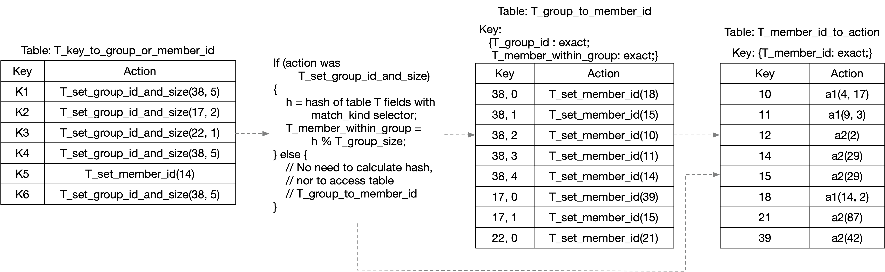

# action_selector tables variant 1

Having a table `T` with `implementation =
action_selector(HashAlgorithm.H, N, W)` in a P4_16 program with the
v1model architecture, like this:

```
    // Program fragment #1

    table T {
        key = {
            // <table T selectorKeyElementList> contains all fields of
            // the table key that have a match_kind 'selector', and
            // the next line contains all the rest of the fields.
            <table T nonSelectorKeyElementList>;
            <table T selectorKeyElementList>;
        }
        actions = { <table T actionList> }
        <other tableProperties of table T here>
        implementation = action_selector(HashAlgorithm.H, N, W);
    }

    // to apply the table:
    T.apply();
```

is functionally equivalent to the code below with three tables:

```
    // Program fragment #2

    // X is the smallest integer such that 2^X >= N, so that a bit<X>
    // value is just large enough to represent an index into a table
    // with N entries.
    bit<X> T_group_id;
    bit<X> T_group_size;    // See Note 1 below
    bit<X> T_member_id;
    bit<W> T_member_within_group;

    action T_set_group_id_and_size (bit<X> group_id,
                                    bit<X> group_size)
    {
        T_group_id = group_id;
        T_group_size = group_size;
    }
    action T_set_member_id (bit<X> member_id) {
        T_member_id = member_id;
    }
    table T_key_to_group_or_member_id {
        key = { <table T nonSelectorKeyElementList> }
        actions = {
            T_set_group_id_and_size;
            T_set_member_id;    // See Note 2 below
        }
        <other tableProperties of table T here>
    }
    table T_group_to_member_id {
        key = {
            T_group_id            : exact;
            T_member_within_group : exact;
        }
        actions = { T_set_member_id; }
        size = N;    // See Note 3 below
    }
    table T_member_id_to_action {
        key = { T_member_id : exact; }
        actions = { <table T actionList> }
        size = N;
    }

    // to apply the table:
    switch (T_key_to_group_or_member_id.apply().action_run) {
        T_set_group_id_and_size: {
            // See Notes 4 and 5 below
            bit<W> T_selector_hash;
            T_selector_hash = (least significant W bits of the output
               of HashAlgorithm.H, when given the fields in
               <table T selectorKeyElementList> as input);
            T_member_within_group = T_selector_hash % T_group_size;
            T_group_to_member_id.apply();
        }
    }
    T_member_id_to_action.apply();
```


# Example table configuration and packet processing

Below is a figure showing an example configuration with several
entries in the three tables of Program fragment #2.



Example for packet #1 that selects a member from a group with 5
members:

+ packet #1 looks up table `T_key_to_group_or_member_id` and matches
  the entry with key K4
+ the action `T_set_group_id_and_size` of that entry performs these
  assignments:
  + `T_group_id = 38`
  + `T_group_size = 5`
+ After that action is done, these assignments are performed:
  + `T_selector_hash = 0xCAFF` (made-up hash value for this example)
  + `T_member_within_group = 0xCAFF % 5 = 2`
+ Look up table `T_group_to_member_id` with these key field values:
  + `T_group_id = 38`
  + `T_member_within_group = 2`
+ the action `T_set_member_id` of the matching entry performs this
  assignment:
  + `T_member_id = 10`
+ Look up table `T_member_id_to_action` with key field value:
  + `T_member_id = 10`
+ the action `a1(4, 17)` is executed, where `a1` is one of the actions
  that the P4 developer specified in table `T`'s action list.

Example for packet #2 that directly specifies a member in the first
table lookup:

+ packet #2 looks up table `T_key_to_group_or_member_id` and matches
  the entry with key K5
+ the action `T_set_member_id` of the matching entry performs this
  assignment:
  + `T_member_id = 14`
+ The `switch` statement does nothing.  There is an implicit `default`
  case for the `switch` statement that is a no-op.
+ Look up table `T_member_id_to_action` with key field value:
  + `T_member_id = 14`
+ the action `a2(29)` is executed, where `a2` is one of the actions
  that the P4 developer specified in table `T`'s action list.

WARNING: My opinion is that variant 1 described here has a significant
disadvantage, and anyone implementing P4 on a target device should
think twice (or three times) before using it.  I believe that the main
purpose of describing variant 1 in detail is to clearly show what this
disadvantage is.

In the example configuration above, suppose the control plane software
wishes to remove a member from group 38, so it will have 4 elements.

What table entries need to be changed to implement this?  There are 3
entries in table `T_key_to_group_or_member_id`, the ones with keys K1,
K4, and K6, that all contain the value 5 for the group size.  All of
those occurrences must be changed to 4.  That can be done, of course,
but note that depending upon the use case for this table, there could
be thousands of entries in `T_key_to_group_or_member_id` that need to
be updated.

This is not necessarily a functional problem for how packets are
processed, but it is potentially a serious performance problem for
implementing the control plane software.


# Detailed notes/questions on program fragment #2

Note 1: TBD: Should T_group_size be X bits wide?  It needs to be able
to represent any integer value in the range [1, M], where M is the
maximum number of elements allowed in a group.  The minimum value of 1
assumes that the control plane does not permit making a table entry
'point at' a group id unless that group id contains at least 1 member,
and that while the group id is 'pointed at' by at least one table
entry, the control plane will not be allowed to remove its last
member.  If the plan is that M can be as large as N, one way to always
represent a value S in the range [1, N] is to store the value (S-1),
adding 1 to the value before using it elsewhere.

Note 2: With the current p4c and behavioral-model code as of
2017-Sep-01, P4_14 action profiles with dynamic selectors, and P4_16
tables with implementation action_selector(), are both allowed to have
a table entry 'point at' a member directly, without going through a
group.  This is by design.  See this issue for an example and
discussion: https://github.com/p4lang/behavioral-model/issues/438

Note 3: TBD: What should the size of table T_group_to_member_id be?
The same value N as for table T_member_id_to_action?

Note 4: TBD: Does the code below correctly represent how
HashAlgorithm.H and W are intended to be used?

Note 5: TBD: Are there any other ways intended to be implemented for
calculating 'T_member_within_group' other than as a deterministic
function of values of the fields of T's key with match_kind
'selector'?

Tables with implementation `action_selector()` can do everything that
a table with implementation `action_profile()` can do, and more.

If you choose, you may restrict yourself only to do control plane
operations on a table `TS` with implementation `action_selector()`
that are defined for a corresponding table `TA` with implementation
`action_profile()`.  If you do this, `TS` will have exactly the same
forwarding behavior as table `TA`.

The implementations for the following `simple_switch_CLI` commands
described in the previous section can be carried over with only one
small modification for `action_selector()` tables.

```
    act_prof_create_member
    act_prof_delete_member
    act_prof_modify_member

    table_indirect_add
    table_indirect_delete
```

The only modification necessary is to use the table name
`T_key_to_group_or_member_id` in place of `T_key_to_member_id`.

TBD: Document implementations of the following commands that are
specific to tables with implementation `action_selector()`

```
    table_indirect_add_with_group

    act_prof_create_group
    act_prof_delete_group

    act_prof_add_member_to_group
    act_prof_remove_member_from_group
```

`act_prof_create_group <action profile name>` creates an group with 0
members.  No changes to the tables need to be made as a result of this
operation.  Control software should maintain the id of each group, and
for each one, its set of members.

`act_prof_add_member_to_group <action profile name> <member handle>
<group handle>` causes an error if either the member handle or group
handle are not currently existing, or if the member is already in the
group.  Otherwise, the member is added to the group's set of members.

    table_add T_group_to_member_id T_set_member_id <group_id> <member_within_group> => <member_id>
    table_modify T_key_to_group_or_member_id T_set_group_id_and_size <entry handle> => <group_id> <new_group_size>

where `<member_within_group>` is the number of members the group had
before the operation began, e.g. 0 if the group was empty, 5 if the
group initially had 5 members and we are now adding a 6th.

The `table_modify` must be done for every entry of table
T_key_to_group_or_member_id that has the `<group_id>` of the group
being modified.  This could be a large number.  To avoid this, an
alternate implementation could have yet another intermediate table
with key <group_id> an an action that assigns the size of the group to
a temporary metadata field.  Then changes in the size of a group would
only need to be updated in one place, at the cost of another dependent
table `apply()` operation.


`act_prof_remove_member_from_group <action profile name> <member
handle> <group handle>` causes an error if either the member handle or
group handle are not currently existing, or if the member is not
currently in the group.  It is also an error if the group is 'in use',
i.e. it is the result of at least one entry in table
`T_key_to_group_or_member_id`, and the group has only one member in
it.  All 'in use' groups must always have at least one member.

If none of these error conditions hold, the member is removed from the
group's set of members.  This could be done by 'shifting' all members
with a `member_within_group` number larger than the removed member,
decrementing them all by one.  Another way, if control software
maintains the `member_within_group` values for all members of a group,
is to do:

    table_modify T_group_to_member_id T_set_member_id <entry handle> => <member_id>

but only for the <entry handle> of the removed member, overwriting the
<member_id> with that of the member that had the largest
`member_within_group` value.  In either case, you must also do a
`table_delete` on table `T_group_to_member_id` to remove the entry
that had the largest `member_within_group` value.

Finally, as for `act_prof_add_member_to_group`, the size of the group
must be modified everywhere it is stored, to be one smaller than
before.  See the notes for that operation for how to limit this to a
single table entry, vs. updating potentially many places where the
group size is stored.


`act_prof_delete_group <action profile name> <group handle>` is an
error if the group does not exist, or if the group is 'in use', as
described above.

It is an implementation choice for the control plane software whether
this operation is allowed when the group has at least one member.  If
so, all group members should be removed first, as described above for
`act_prof_remove_member_from_group`, except it might be optimized with
the knowledge that all members are going to be removed.

Once the group is empty, there is nothing in the tables to remove to
delete a group.  It is purely a control plane software operation of
'forgetting' the group id, i.e. restoring the state so that the group
id could be reallocated again by a future `act_prof_create_group`
operation.


`table_indirect_add_with_group <table name> <match fields> => <group
handle> [priority]` is an error if the group does not exist, or
contains 0 members.

If no such error conditions apply, it is implemented by:

    table_add T_key_to_group_or_member_id T_set_group_id_and_size <match fields> => <group_id> <group_size>


# simple_switch_CLI commands specific to action_profile and action_selector tables

Below is a list of all simple_switch_CLI commands that have behavior
specific to tables with implementation `action_profile()` or
`action_selector()`:

```
act_prof_add_member_to_group
act_prof_create_group
act_prof_create_member
act_prof_delete_group
act_prof_delete_member
act_prof_dump
act_prof_dump_group
act_prof_dump_member
act_prof_modify_member
act_prof_remove_member_from_group
table_dump_group (deprecated - use act_prof_dump_group)
table_dump_member (deprecated - use act_prof_dump_member)
table_indirect_add
table_indirect_add_member_to_group (deprecated - use act_prof_add_member_to_group)
table_indirect_add_with_group
table_indirect_create_group (deprecated - use act_prof_create_group)
table_indirect_create_member (deprecated - use act_prof_create_member)
table_indirect_delete
table_indirect_delete_group (deprecated - use act_prof_delete_group)
table_indirect_delete_member (deprecated - use act_prof_delete_member)
table_indirect_modify_member (deprecated - use act_prof_modify_member)
table_indirect_remove_member_from_group (deprecated - use act_prof_remove_member_from_group)
table_indirect_set_default
table_indirect_set_default_with_group
```

Below is the same list of commands, with the deprecated ones removed,
and arranged in groups with related effects.

The commands marked "S" are only applicable for a table with
implementation `action_selector()`.  The others are applicable for
both `action_profile()` and `action_selector()` tables.

```
  # Commands to manipulate entries in the 'main table', i.e. the one
  # that maps the user-specified search key fields to a member, or to
  # a group.  It appears that perhaps simple_switch_CLI does not
  # support any method of modifying an existing main table entry,
  # i.e. there is no analog to the 'table_modify' command that exists
  # for normal/simple tables.
  table_indirect_add
S table_indirect_add_with_group
  table_indirect_delete
  table_indirect_set_default
S table_indirect_set_default_with_group

  # Commands to create and delete groups.  Groups always have 0
  # members when first created.
S act_prof_create_group
S act_prof_delete_group

  # Commands to add members to, or remove members from, an existing
  # group.  These are the only supported ways to modify a group.
S act_prof_add_member_to_group
S act_prof_remove_member_from_group

  # Commands to create, delete, and modify members.  Each member has
  # its own independent action and action parameter values, which can
  # be chosen from the user-defined `actions` list of the table.
  act_prof_create_member
  act_prof_delete_member
  act_prof_modify_member

  # Show/dump commands for debugging.  They have no effect on the
  # state of the system.
S act_prof_dump_group
  act_prof_dump_member
  act_prof_dump
```
