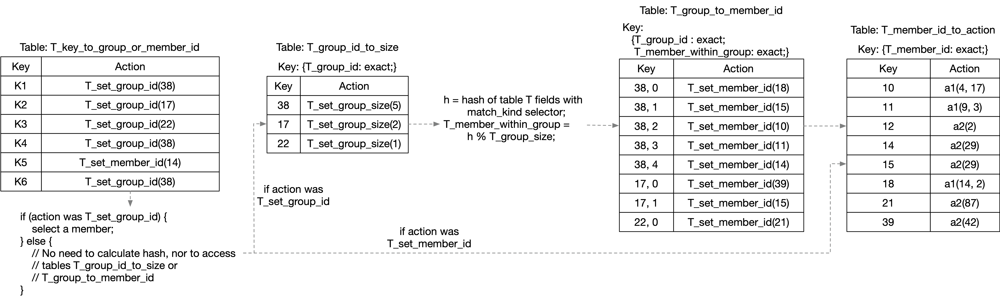

# action_selector tables variant 2

See the comparison between action selector variants at
[README-action-selector-variant-comparison.md](README-action-selector-variant-comparison.md)
for links to all of them.

Having a table `T` with `implementation =
action_selector(HashAlgorithm.H, N, W)` in a P4_16 program with the
v1model architecture, like this:

```
    // Program fragment #1

    table T {
        key = {
            // <table T selectorKeyElementList> contains all fields of
            // the table key that have a match_kind 'selector', and
            // the next line contains all the rest of the fields.
            <table T nonSelectorKeyElementList>;
            <table T selectorKeyElementList>;
        }
        actions = { <table T actionList> }
        <other tableProperties of table T here>
        implementation = action_selector(HashAlgorithm.H, N, W);
    }

    // to apply the table:
    T.apply();
```

is functionally equivalent to the code below with four tables.

This variant (number 2) solves the issue described for variant 1 where
changing the size of a group could require many changes to the first
table.

It does this by storing the group size of every group in only one
place, in a new table named `T_group_id_to_size`.  The disadvantage is
that it requires another dependent table search in the data plane,
increasing latency a bit.

```
    // Program fragment #2

    // X is the smallest integer such that 2^X >= N, so that a bit<X>
    // value is just large enough to represent an index into a table
    // with N entries.
    bit<X> T_group_id;
    bit<X> T_group_size;    // See Note 1 below
    bit<X> T_member_id;
    bit<W> T_member_within_group;

    action T_set_group_id (bit<X> group_id)
    {
        T_group_id = group_id;
    }
    action T_set_member_id (bit<X> member_id) {
        T_member_id = member_id;
    }
    table T_key_to_group_or_member_id {
        key = { <table T nonSelectorKeyElementList> }
        actions = {
            T_set_group_id;
            T_set_member_id;    // See Note 2 below
        }
        <other tableProperties of table T here>
    }
    action T_set_group_size (bit<X> group_size) {
        T_group_size = group_size;
    }
    table T_group_id_to_size {
        key = {
            T_group_id        : exact;
        }
        actions = { T_set_group_size; }
        size = TBD;    // TBD: This should be the maximum number of groups
    }
    table T_group_to_member_id {
        key = {
            T_group_id            : exact;
            T_member_within_group : exact;
        }
        actions = { T_set_member_id; }
        size = N;    // See Note 3 below
    }
    table T_member_id_to_action {
        key = { T_member_id : exact; }
        actions = { <table T actionList> }
        size = N;
    }

    // to apply the table:
    switch (T_key_to_group_or_member_id.apply().action_run) {
        T_set_group_id: {
            // See Notes 4 and 5 below
            T_group_id_to_size.apply();
            bit<W> T_selector_hash;
            T_selector_hash = (least significant W bits of the output
               of HashAlgorithm.H, when given the fields in
               <table T selectorKeyElementList> as input);
            T_member_within_group = T_selector_hash % T_group_size;
            T_group_to_member_id.apply();
        }
    }
    T_member_id_to_action.apply();
```

# Example table configuration and packet processing

Below is a figure showing an example configuration with several
entries in the four tables of Program fragment #2.



This variant is so similar to variant 1 that I will not give examples
for packet processing for this code.  If you look at the two examples
of packet processing for variant 1, the behavior here is nearly
identical, with the only exception that the group size value comes
from the second table lookup instead of the first.

Note: Much of the later discussion in file
[README-action-selector-variant1.md](README-action-selector-variant1.md)
applies to this variant 2 as well, except any mention of
`T_set_group_id_and_size` should be replaced with `T_set_group_id`.

See
[README-action-selector-variant1.md](README-action-selector-variant1.md)
for Notes 1 through 5, and other discussion and questions.
