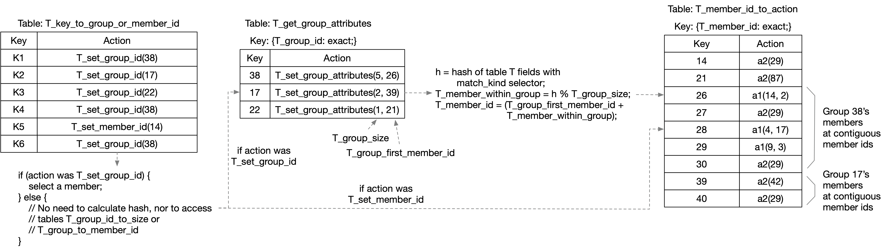

# action_selector tables variant 3

See the comparison between action selector variants at
[README-action-selector-variant-comparison.md](README-action-selector-variant-comparison.md)
for links to all of them.

Having a table `T` with `implementation =
action_selector(HashAlgorithm.H, N, W)` in a P4_16 program with the
v1model architecture, like this:

```
    // Program fragment #1

    table T {
        key = {
            // <table T selectorKeyElementList> contains all fields of
            // the table key that have a match_kind 'selector', and
            // the next line contains all the rest of the fields.
            <table T nonSelectorKeyElementList>;
            <table T selectorKeyElementList>;
        }
        actions = { <table T actionList> }
        <other tableProperties of table T here>
        implementation = action_selector(HashAlgorithm.H, N, W);
    }

    // to apply the table:
    T.apply();
```

is functionally equivalent to the code below.

Variants 1 and 2 have a property in common that is nice for the driver
software, but a disadvantage for the data plane implementation.

When the table match points at a group (not directly at an individual
member), it calculates a value `T_member_within_group` that is in the
range `[0, T_group_size - 1]`, regardless of which group id is
involved.  Then table `T_group_to_member_id` maps pairs of values
`(T_group_id, T_member_within_group)` to `T_member_id` values for the
final table lookup of the actual "user action" to be performed.

This is a disadvantage for the data plane, because it requires a
dependent table search on table `T_group_to_member_id`, which
increases latency a bit, and requires storage for the table entries.

Variant 3 shown below eliminates that table, but it does so in a way
that adds a little bit of complexity to the driver software required
to configure it.  Instead of mapping a pair `(T_group_id,
T_member_within_group)` to `T_member_id` via entries of a table, it
always calculates:

    T_member_id = T_group_first_member_id + T_member_within_group;

This eliminates the need for table `T_group_to_member_id`, but with
the added restriction that all `T_member_id` values for the same group
must be consecutive integer values.  Thus as group sizes grow, they
might "bump into" a `T_member_id` value in use by a different group.

To avoid using the same `T_member_id` value for two different groups,
the driver software should implement something like a memory allocator
with garbage collection and moving of previously-allocated memory
blocks.  This is more like Java's GC where memory blocks can be moved
after they are initially allocated to compact the still-live objects
into a smaller amount of memory, without the restriction of C
malloc/free, where a block of memory can never be moved after it is
first allocated.  The software could choose not to implement the
moving of previously-allocated contiguous groups, with the
disadvantage that it would have to fail attempts to increase the size
of a group if it would cause the group to overlap with a later
contiguous group.

If moving of groups is implemented by the switch driver software, it
can be done atomically relative to packet processing, by following
this sequence for the entries of table `T_member_id_to_action`:

+ first add copies of the to-be-moved group's entries, in a range of
  `T_member_id` values that are currently not in use by any group.
+ Then modify the one table entry in table `T_get_group_attributes`
  for the group to change its value of `T_group_first_member_id` from
  the current value, to point at the new location.
+ When that is complete, the old range of `T_member_id` values for the
  group can have their entries removed, and marked in the driver
  software as empty, and available for use by other groups.

Note that control plane API group id and member id values, if selected
by the control plane software, not the driver software, _must_ be
remapped in the driver software for this variant to work.  Otherwise
all of the low level data plane restrictions on contiguous ranges will
"leak out" and put target-specific restrictions on the control plane
software.  The control plane software should not be burdened with
those restrictions.

```
    // Program fragment #2

    // X is the smallest integer such that 2^X >= N, so that a bit<X>
    // value is just large enough to represent an index into a table
    // with N entries.
    bit<X> T_group_id;
    bit<X> T_group_size;    // See Note 1 below
    bit<X> T_group_first_member_id;
    bit<X> T_member_id;
    bit<W> T_member_within_group;

    action T_set_group_id (bit<X> group_id)
    {
        T_group_id = group_id;
    }
    action T_set_member_id (bit<X> member_id) {
        T_member_id = member_id;
    }
    table T_key_to_group_or_member_id {
        key = { <table T nonSelectorKeyElementList> }
        actions = {
            T_set_group_id;
            T_set_member_id;    // See Note 2 below
        }
        <other tableProperties of table T here>
    }
    action T_set_group_attributes (bit<X> group_size,
                                   bit<X> group_first_member_id)
    {
        T_group_size = group_size;
        T_group_first_member_id = group_first_member_id;
    }
    table T_get_group_attributes {
        key = {
            T_group_id        : exact;
        }
        actions = { T_set_group_attributes; }
        size = TBD;    // TBD: This should be the maximum number of groups
    }
    table T_member_id_to_action {
        key = { T_member_id : exact; }
        actions = { <table T actionList> }
        size = N;
    }

    // to apply the table:
    switch (T_key_to_group_or_member_id.apply().action_run) {
        T_set_group_id: {
            // See Notes 4 and 5 below
            T_get_group_attributes.apply();
            bit<W> T_selector_hash;
            T_selector_hash = (least significant W bits of the output
               of HashAlgorithm.H, when given the fields in
               <table T selectorKeyElementList> as input);
            T_member_within_group = T_selector_hash % T_group_size;
            T_member_id = T_group_first_member_id + T_member_within_group;
        }
    }
    T_member_id_to_action.apply();
```


# Example table configuration and packet processing

Below is a figure showing an example configuration with several
entries in the three tables of Program fragment #2.



See README-action-selector-variant1.md for Notes 1 through 5, and
other discussion and questions.
