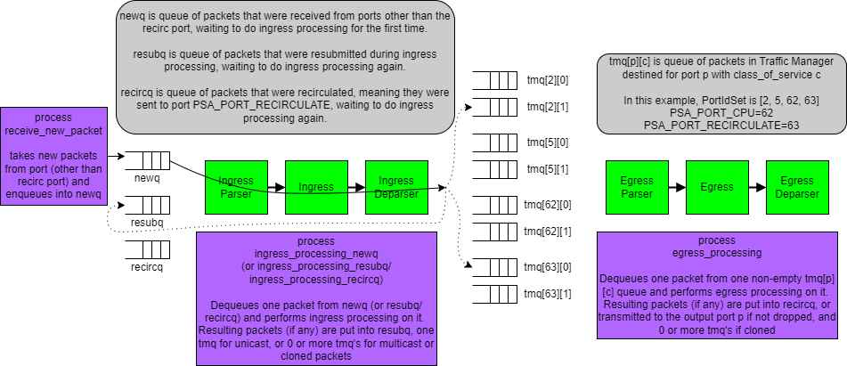

# Introduction

This directory contains a first attempt at specifying the PSA
(Portable Switch Architecture) using a language that I will be
experimenting with as I go.

The structure of this specification is a set of processes with guard
conditions on each process.  Any process whose guard condition is true
can be executed, and the choice between them is arbitrary.  Logically
one process is executed at a time in the system.  Of course a real
implementation would often perform many of these processes in
parallel, but for simplicity of writing and understanding the
specification, the code is written in a way that assumes that at most
one process is executed at a time.

This is similar to the looping statement `do` in the Guarded Command
Language: https://en.wikipedia.org/wiki/Guarded_Command_Language

It seems desirable if an architecture specification can describe all
possible behaviors for a correct implementation of an architecture,
and then implementations might restrict themselves to a subset of what
the specification allows.  I do not yet know if `psa-try1.p4` achieves
that goal.

Because of the level of granularity of the processes in `psa-try1.p4`,
a real implementation might allow behavior that is visible to "the
outside" that is impossible according to this specification.

TODO: I cannot think of an example of this at the moment, but have
marked this with TODO to remind me to think of it more later, after
the specification is written.

# Parameters defining a PSA implementation

Refer to [this article](../psa-notes.md) on parameters that affect the
behavior of a PSA implementation.

Below I will give choices for some of those options mentioned in that
article, to be used in writing this specification.

# Details that the PSA specification is vague about

## What is included in the packet as given to the parser, and expected out of the deparser?

This example specification requires that the packet given to the
parser, and expected out of the deparser, includes none of these parts
of the Ethernet frame:

+ Preamble
+ Start frame delimiter
+ Ethernet FCS (Frame Check Sequence, aka CRC)
+ Ethernet Interpacket gap

## What packet length is used when updating Counter and Meter externs that use packet length?

This example specification uses the length of the packet as received
by the P4 parser most recently before the counter or meter extern
method is called, which is the PSA ingress parser for counter and
meter operations invoked during ingress, and the PSA egress parser for
counter and meter operations invoked during egress.

## What happens if a packet output by a deparser is outside of supported range of lengths?

This example specification will drop packets output by a deparser that
are shorter than `MinPacketLength`, or longer than `MaxPacketLength`.

# State that is "global" in the architecture

This figure gives an overview of the packet queues that represent the
global state of the architecture specification, and what each process
does.

## Traffic manager configuration state

This state changes only when the control plane makes explicit API
calls to change it.  Processing packets never causes it to change,
except perhaps for any packet/byte counters that might be included.

`mcast_group_replication_list` is an instance of the `ExactMap`
extern.  Its value represents the multicast group configuration table,
i.e. for each multicast group id, what are the list of (egress_port,
instance) pairs to make packet copies for?

`clone_session_entry` is an instance of the `ExactMap` extern.  Its
value represents the clone session configuration table, i.e. for each
clone session id, where should cloned copies of the packet be sent,
with what class_of_service value, and should the packet be truncated
to a specified maximum length, or not?

## Traffic manager dynamic state

This state can change as packets are processed, perhaps even for most
or all packets processed.

+ `tmq[port][class]` - A queue of packets with class `class` destined
  for port `port`, ready to do egress processing

I will consider the set of ports and classes to be unchanging for now.
Some implementations may provide a feature where ports can be enabled
or disabled at run time (e.g. reconfiguring a 100 Gbps Ethernet port
to operate instead as 4 separate 25 Gbps Ethernet ports), or classes
can be added or removed at run time.

## Ingress dynamic state

Separate queues for packets from these places:

+ `newq` - New packets from the outside, ready to do ingress processing
+ `resubq` - Resubmitted packets, ready to do ingress processing
+ `recircq` - Recirculated packets, ready to do ingress processing

Note: An implementation might have multiple recirculation queues,
e.g. one per some kind of traffic class value.  Similarly it might
have a separate `newq` per (input port, traffic class) pair.

# A note on the "granularity" of specification psa-try1.p4

There are many possible specifications of PSA using this style.

One could make what each process does smaller than `psa-try1.p4` does.
For example, there could be a process that instead of executing all of
the ingress parser, ingress control, and ingress deparser on each
packet before finishing, could operate as follows:

+ One process executes only the ingress parser on a packet, saving all
  intermediate results in a queue that is after the ingress parser,
  but before the ingress control.
+ Another process executes only the ingress control on a packet,
  saving all intermediate results in a queue that is after the ingress
  control, but before the ingress deparser.
+ Yet another process executes only the ingress deparser on a packet.

And similarly for egress parser, egress control, and egress deparser.

One could even imagine breaking down the ingress control into multiple
parts, each executed by a separate process, e.g. 12 processes, one per
Tofino1 MAU stage.  However, that would require some way to take the
ingress control and split it into multiple parts, such that composing
them is equivalent to the ingress control code that the P4 developer
writes.

I mention this simply to point out that, as usual, there is more than
one way to do things, including writing specifications.

I would guess that specifications written in these different ways
might have different possible behaviors that were visible externally,
but do not have any examples of this at this time.

# Example of variant of psa-try1.p4 that has more externally observable behaviors

This is not just a variant for the sake of making up a variant.  I
believe that this variant of psa-try1.p4 is actually closer to how
some switch ASICs work than psa-try1.p4 is.

Sending a unicast packet from ingress to the traffic manager (TM) is
just a single enqueue operation, and the common case for most switches
in operation.

Sending a multicast packet from ingress to the TM often goes through a
little hardware logic that does the packet replication in such a way
that at most one copy of the packet is created every clock cycle or
so.

If packet A arrives and is multicast to a group with 10 output ports,
and immediately afterwards packet B arrives and is unicast to one of
those 10 output ports, say port P, such a switch implementation could
enqueue packet B in the TM queue for port P _before_ it creates the
copy of packet A going to port B and enqueueing it.

psa-try1.p4 will never exhibit this behavior, because it models the
behavior such that all copies are made of one packet, before the next
packet does ingress processing.

We could write a variant of psa-try1.p4 such that during ingress
processing, it puts packets to be multicast after ingress processing
into a new queue `multicastq`, and a new process representing the
packet replication engine will dequeue packets from `multicastq`,
replicate them, and enqueue the copies in the appropriate `tmq`'s.
However, unicast packets from ingress processing will go straight to
being enqueued in the destination `tmq`.

So this is just one of probably many possible examples showing that
how one chooses to write a specification in this "collection of
processes connected by queues" style can affect the externally
observable behaviors.
